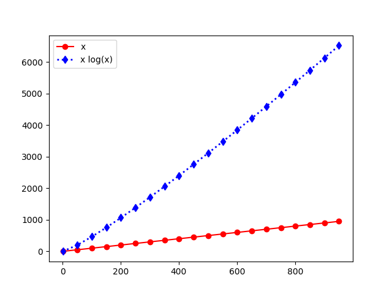

## Opérations arithmétiques

Utilisez Python comme une grosse calculatrice, en faisant des calculs numériques sur des entiers et des nombres flottants.

1. Vérifiez les opérations `+`, `-`, `*`, `/`, `//`, `**`, `%` sur quelques valeurs de vos choix ;
2. On peut afficher quelque chose avec la fonction `print`, faites quelques affichages du genre suivant :

```
print('2000 + 20 + 1 = %i' % (2000 + 20 + 1))  # ancienne syntaxe
print('2000 + 20 + 1 = {}'.format(2000 + 20 + 1))
print(f'2000 + 20 + 1 = {2000 + 20 + 1}'))  # syntaxe à privilégier
```

3. Vérifiez que les opérations arithmétiques `+` n'est pas associative (e.g., `1 + (10e20 - 10e20) == 1` mais `(1 + 10e20) - 10e20 == 0`), et que les opérations sur les flottants ne sont pas exactes non plus : `0.1 + 0.1 + 0.1 != 0.3` car les nombres flottants sont représentés comme des fractions 2-adiques (cela sera revu en cours plus tard).
4. TODO: d'autres tâches sur les calculs arithmétiques, voir au tableau ;

---

## Types principaux et variables

Les principaux types des variables en Python sont les suivants :

- Les types de bases sont des `bool` pour les Booléens (`True` ou `False`), `int` pour des entiers (de taille arbitraire), `float` pour des flottants à précision 32 ou 64 bits selon la machine, et `complex` pour des nombres complexes (utilisant des `float`) ;
- Les types construits comme les listes `list` (tableaux dynamiques, mutables), les n-uplets `tuple` (immutables), les dictionnaires `dict` (mutables), et les ensembles `set` (mutables).
- Les fonctions sont les objets
- A priori, les classes et autres constructions de Python ne seront pas utilisées en informatique pour tous ou en informatique dans les autres matières.

---

## Boucles `if/else/elif`, `for` et `while`

- Prenez le temps de vous renseigner de nouveau sur le concept *et la syntaxe* de ces trois constructions.
- Au pire, demandez à l'oral et j'expliquerai une bonne fois pour tout le monde.

---

## Logique booléenne, affichage avec `print` et tables de vérités

Un des type de base est les booléens `bool`, qui n'ont que deux valeurs, `False` et `True`.
En Python on peut utiliser les opérateurs unaires `not b`, ou binaires `a or b` (souvent noté $a \vee b$) et `a and b` ($a \wedge b$).
Écrivez quelques lignes de Python qui affichent le résultat de ces trois opérateurs, puis une u deux avec des formules booléennes plus compliquées, sous la forme d'une table de vérité (on dit aussi table de Karnaugh) :

```
a | b | a ^ b
-------------
0 | 0 | 0
0 | 1 | 0
1 | 0 | 0
1 | 1 | 1
```

---

## Fonctions, récursive ou non

On peut définir facilement des fonctions en Python avec la syntaxe suivante :

```
def nomFonction(arg1, arg2, ...):
    ...
    return valeurRetour
```

Le typage n'est pas obligatoire, mais depuis Python 3.6 on peut ajouter des étiquettes de types à la première ligne, pour déclarer un peu mieux ce que l'on attends des résultats.
Ces étiquettes ne seront pas utilisées par l'interprète Python, en particulier l'appel à la fonction marchera aussi même si les types ne sont pas respectés.

```
from math import sqrt

def hypothenuse(x: float, y: float) -> float:
    return sqrt(x**2 + y**2)
```

On peut définir des fonctions récursives, i.e., qui s'appellent elles-même.

```
def meilleureFaconMarcher(nombrePas):
    if nombrePas < 0:
        return  # on s'arrête
    else:
        marcherUnPas()
        return meilleureFaconMarcher(nombrePas - 1)
```

## Un algorithme à programmer pour s'échauffer

Programmez la méthode dite de Héron ou des Babyloniens pour calculer une racine carrée approchée d'un nombre quelconque positif.
Il s'agit de poser $a\in\mathbb{R}^+$ et de chercher à calculer $\sqrt{a}$ de façon approchée.
On pose $x_0 = a$ premier terme d'une suite récurrente d'ordre $1$, qui se calcule facilement comme cela : $x_{n+1} = \frac{x_n + \frac{a}{x_n}}{2}$, pour $n$ indice de la suite qui augmente au fur et à mesure dans la formulation en maths, mais qui peut ne pas être utilisé dans la formulation en Python. On peut avoir juste une seule variable `xn` qui augmente.
Le critère d'arrêt à choisir pour ce calcul itéré de $(x_n)_n$ peut être de fixer à l'avance le nombre d'étapes, $n_{\max}$, ou de fixer une précision $\varepsilon$ et de s'arrêter seulement quand $|x_n^2 - a|<\varepsilon$.

---

## Le crêpier psycho-rigide

Si on a le temps, on introduit cette activité en informatique débranchée, présentée au tableau et à l'oral, et il faudra l'implémenter en Python lors du prochain TD/TP de rattrapage NSI.

---

## Classes et objets

Dans Python, toutes les valeurs manipulées sont en fait des *objets*, instances de *classes*.
Nous ne donnerons pas de rappels sur les classes et la programmation orientées objets ici, mais peut-être plus tard dans d'autres TD de rappels de NSI.

---

## Opérations sur des fichiers

Avec Python, lire un fichier se fait naturellement ainsi :

```
mode = 'r'  # 'r' pour lire
fichier1 = open('nom_du_fichier.txt', mode)
for ligne in fichier1:
    print('ligne =', ligne)

mode = 'w'  # 'w' pour écrire, 'a' pour écrire depuis la fin
fichier2 = open('nom_du_fichier.txt', mode)
for i in range(10):
    print(f'ligne numéro {i}', file=ligne)
```

Il vaut mieux penser à fermer les fichiers ouverts, pour être sûr que leur contenu est bien à jour. Une manière de faire sans avoir à penser à ouvrir et fermer les fichiers est d'utiliser un *contexte* :

```
with open('nom_autre_fichier.csv') as fichier_csv:
    # Manipulations avec ce fichier
    ...
# après le bloc with... le fichier est fermé et n'existe plus
```

---

## Tracés de courbes avec `matplotlib`

Nous n'utiliserons *pas* matplotlib en informatique en MP2I, mais vous pourrez vous en servir en physique et maths et SI, alors autant faire quelques rappels.
Typiquement, la bibliothèque s'importe comme ça :

```
import matplotlib.pyplot as plt
```

TODO: Rappels de syntaxe avec `matplotlib`.

Un exemple d'utilisation de cette bibliothèque est donné ci-dessous :

```
import math
X = list(range(1, 1000, 50))
Y1 = [ x for x in X ]
Y2 = [ x * math.log(x) for x in X ]

plt.plot(X, Y1, 'ro-', label='x')
# abrégé pour color='red', marker='o', linestyle='-'

plt.plot(X, Y2, color='blue', marker='d', label='x log(x)',
               linestyle=':', markersize=6, linewidth=2)

plt.legend()  # avec les label='...'
plt.show()    # selon le contexte, il faut demander à voir la figure.
```



---

## Manipulations de vecteurs avec `numpy`

- L'avantage est de pouvoir utiliser les fonctions `numpy` telles que `numpy.cos` qui sont vectorisées par défaut et peuvent donc traiter un vecteur entier en une seule étape, sans écrire de code compliqué.

```
import numpy as np

X = np.arange(1, 1000, 50))
Y1 = X
# pas besoin de listes en compréhension,
# l'opération se fait sur le vecteur
Y2 = X * np.log(X)
```

## Générer des nombres aléatoires

On peut utiliser le module `random` ou `numpy.random`. Le deuxième permet de générer d'un coup un vecteur de valeurs aléatoires, et contient plus de distributions.
En pratique, le premier suffit largement pour les applications basiques que l'on pourrait avoir à écrire en info tronc commun ou en informatique MP2I/MPI (cf. algorithmes probabilistes en MPI).

```
import random

pile_ou_face  = random.randint(0, 1)
de_six_face   = random.randint(1, 6)
carte_a_jouer = random.randint(1, 13)
```

Par exemple, une application de la méthode de Monte-Carlo pour calculer $\pi$ consiste en un tirage d'un grand nombre de points dans $[0,1]\times[0,1]$, et de compter ceux qui sont sous la courbe $y=\sqrt{1-x^2}$ qui correspond au quart de cercle de rayon $1$ et de centre $(0,0)$. Cette fraction de nombre va converger (lentement) vers $\pi/4$ :

```
import random, math

def montecarlo_pour_pi(nombreMaximumPoints: int) -> float:
    nbPointInterieurs: int = 0
    for _ in range(nombreMaximumPoints):
        x, y = random.random(), random.random()
        if math.sqrt(1 - x**2) <= y:
            nbPointInterieurs += 1
    return 4 * nbPointInterieurs / nombreMaximumPoints
```

---

## Dernières remarques

- Pour des rappels de syntaxe plus longs, [cherchez en ligne les feuilles de rappels de syntaxe officielles des oraux de CentraleSupélec](http://jdreichert.fr/Enseignement/CPGE/Divers/fiches_centrale.zip).

----

## Challenges pour les Pythonistas

- Écrire une fonction `cos` qui est une approximation de $x \mapsto cos(x)$ en utilisant les premiers termes (e.g., les $N=10$ premiers) de la décomposition en série entière $\cos(x) = \sum_{n=0}^{+\infty} \frac{x^{2n}}{2n!}$. Pour des valeurs de $x$ entre $-2\pi$ et $2\pi$, comparez votre `cosapprox`$(x)$ approché et la valeur de `math.cos`$(x)$. En faisant varier N de $5$ à $25$, voit-on une amélioration de la précision (i.e., qualité) de l'approximation que vous avez écrite ?
- Avec le module `turtle`, laissez libre court à votre créativité et dessinez quelque chose de joli !
- Travaillez un peu avec des nombres complexes du module, dont la syntaxe est : `x+yj` par exemple `10+4j` pour le complexe `complex(10,4)`. Les fonctions mathématiques sur les nombres complexes existent dans le module `cmath`. Consultez sa documentation, et faites quelques calculs sur des nombres complexes.
